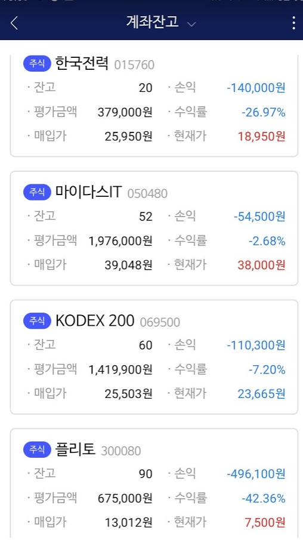

# 2020년 2월 - 코로나발 폭락장

사실 떡락하는것을알고 있었으면 가지고 있던걸 팔아 현금화 시킨뒤 다시 사는 방법을 택했어야 하나 그런 강심장이 아니기에 우선 묻어두고 있었다.

그리고 코스피가 1900을 찍은날, 내 비상금 200만원에 손을 댈 수 밖에 없었다...\(아니 2100하던 주가가 1900하고 다시 올라갈 가능성이 높은데 안살수가!!\)그래서 조금 샀다. 그리고 그다음날 1850이 되었다 그래서 조금 샀다. 그리고 그다음날 1800이 되었다. 그래서 조금 샀다. 그리고 그그극다음날 1700이 되었다. 20만원남기고 샀다. 그리고 그그그다음날 코스피가 1500이 되었다!!!!!!!!!

사실 이때도 조급했던 것 같다. -150만원 까지 찍히는걸 보고 증권앱을 지우고 조금 남은 돈을 빼버렸다. 주식 투자 시작했을때 급하게 하지 말자는 것을 느꼈는데도 또 급해졌다 ㅎㅎ

뭐 그래

총투자액 500만원정도에 -80만원 -15%의 수익률 유지중이다

그리고 이번 폭락장을 겪으며

0원칙. 빛내서 투자하지 마라

1원칙. 남는돈으로 주식 하는 것이다

2원칙. 장기투자해라

3원칙. 분산투자해라

모든 투자자들이 하나같이 저런 말을 하는지 알겠다.

만일 내가 지금 긴급자금이 필요해서 주식에서 돈을 빼야하는데 기다리지 못하면, 지금같은 상황에서 손해가 발생할 것이다. 그리고 내가 플리토에 주식 몰아넣으면 수익률이 와... 그리고 내가 산 것들은 대부분 5년보고 샀다. 플리토 - 스타트업, 빅데이터 회사 / kodex 200 - 주가에 투자 / 마이다스IT - 다니고있는 회사 / 한국전력 - 공기업, 정권바뀌고 수익률 개선 기대

그리고 오늘 플리토 주가가 너무많이 떨어져 있길래 20주를 더 사보았다!

