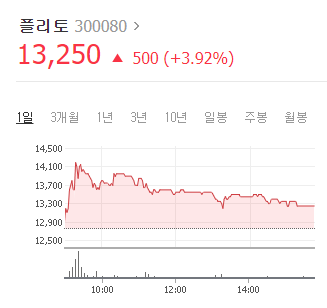

# 9월 7일 - 잡주? 플리토

오늘 플리토가 보인 모양이다 장 초반 한국판 뉴딜 빅데이터 관련 기사로 상승 하더니만 장마감까지 쭉 빠진다. 사실 이종목을 사놓은뒤 매일 있던 현상이였다. 오늘도 올랐을때 별기대 안했다 어짜피 다시 빠질거니까 그걸 알면 15%때 팔고 3%때 다시 사면 안되냐고 묻겠지만, 나는 그런식으로 돈을 벌기 위해 주식을 시작한게 아니다 핫했던 애플 테슬라, 안산 이유가 거품과 거품 사이의 돈을 벌고 싶지 않았기 때문이다. 물론, 지금 주식 모든게 거품일 수 있다. 나는 '팔지 않을 주식'만 살것이며, 수익구간에 들어왔다고 하더라도 팔 생각이 없다.

